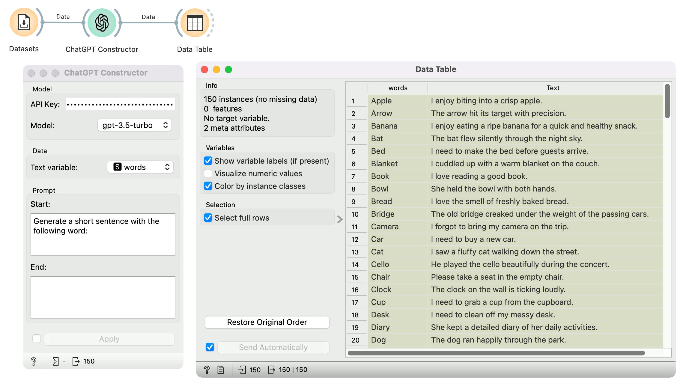

ChatGPT Constructor
===================

Construct a text field using a ChatGPT.

**Inputs**

- Data: data used for prompt to ChatGPT.

**Outputs**

- Data: data, generated by ChatGPT.

**ChatGPT Constructor** enables creating new variables with the ChatGPT API. 

- Model:
   - API Key: personal ChatGPT API key. Required for the widget to run.
   - Model: ChatGPT model. Current options: gpt-3.5-turbo and gpt-4.
- Data:
   - Text variable: variable used in the ChatGPT prompt.
- Prompt:
   - Start: Prompt before the variable text.
   - End: Prompt after the variable text.

Example
-------

Here, we construct a simple data set. We are using the *English Words* dataset, a list of 150 English words. We pass this to the **ChatGPT Constructor** widget, which takes the words as input. In the prompt, we ask ChatGPT to generate a short sentence with each word. On the output, we have a [Data Table](https://orangedatamining.com/widget-catalog/data/datatable/), which shows a new column called *Text* containing the generated sentences.

