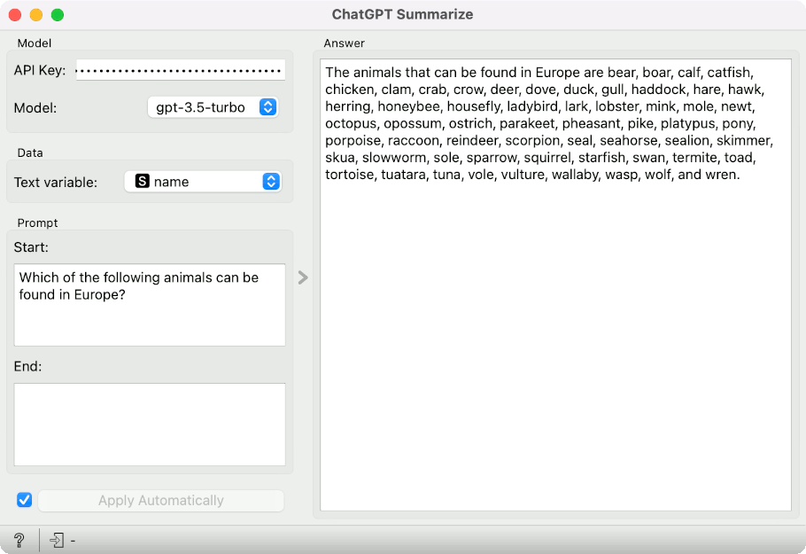
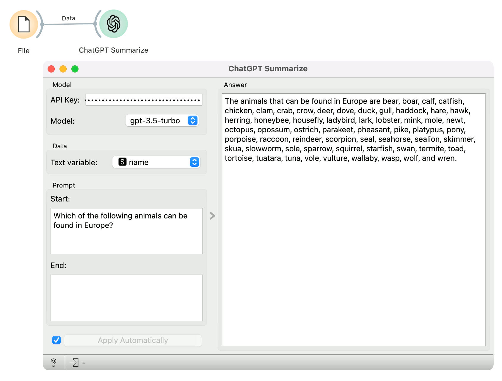

ChatGPT Summarize
=================

Summarize content using a ChatGPT.

**Inputs**

- Data: data used for summarization.

**ChatGPT Summarize** enables summarizing and exploring a given variable with the ChatGPT API. 

- Model:
   - API Key: personal ChatGPT API key. Required for the widget to run.
   - Model: ChatGPT model. Current options: gpt-3.5-turbo and gpt-4.
- Data:
   - Text variable: variable used in the ChatGPT prompt.
- Prompt:
   - Start: Prompt before the variable text.
   - End: Prompt after the variable text.

Example
-------

Here, we explore the *zoo* dataset. We pass this to the **ChatGPT Summarize** widget, which takes the animal names as input. In the prompt, we ask ChatGPT to find all the animals that can be found in Europe. The widget displays the answer on the right.

Please note that this widget is not appropriate for summarizing corpora as it joins variable values and cuts them at certain length (limitation of ChatGPT API).
