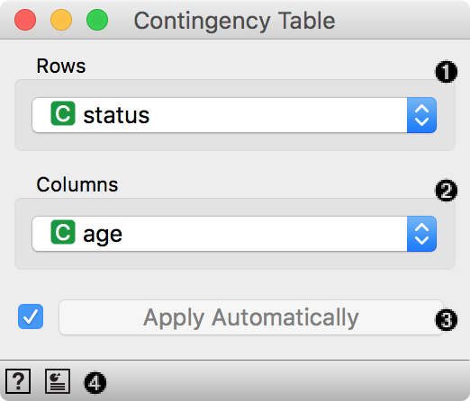
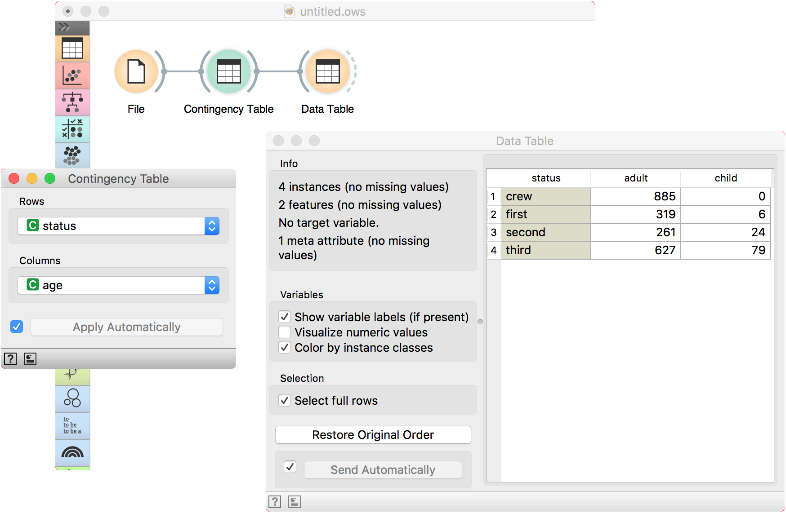

Contingency Table
=================

Construct a contingency table from given data.

Inputs
    Data
        input dataset

Outputs
    Contingency Table
        data table with frequency counts

**Contingency Table** computes occurrences (frequencies) of two discrete variables (rows and columns).

1. Attribute values placed in rows.
2. Attribute values placed in columns.
3. Click *Apply* to commit the changes. To communicate changes automatically tick *Apply Automatically*.
4. Access widget help and produce report.

Example
-------

Contingency table can be computed only for discrete variables, so we will use *titanic* data set as an example. Load the data in the **File** widget and pass it to **Contingency Table**. Say I want to know how many second class passengers on Titanic were children.

Let us select *status* for rows and *age* for columns. We can observe the computed table in a **Data Table** widget. The answer to our question seems to be 24.

