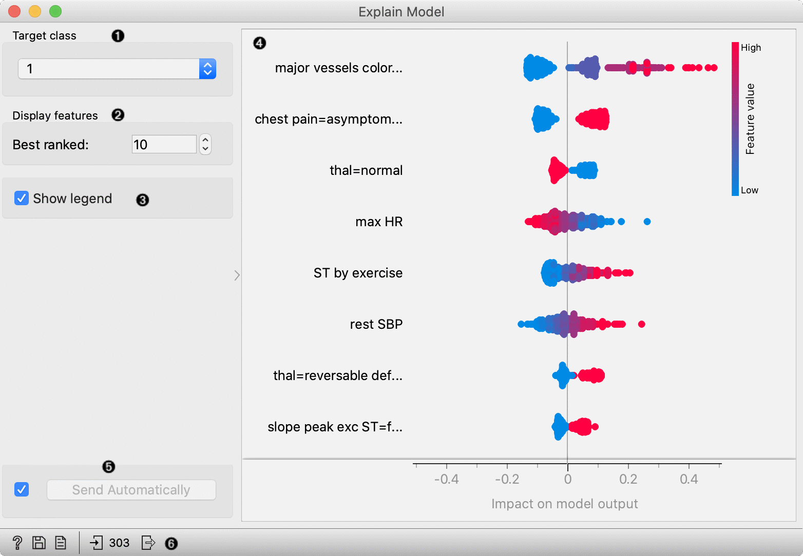
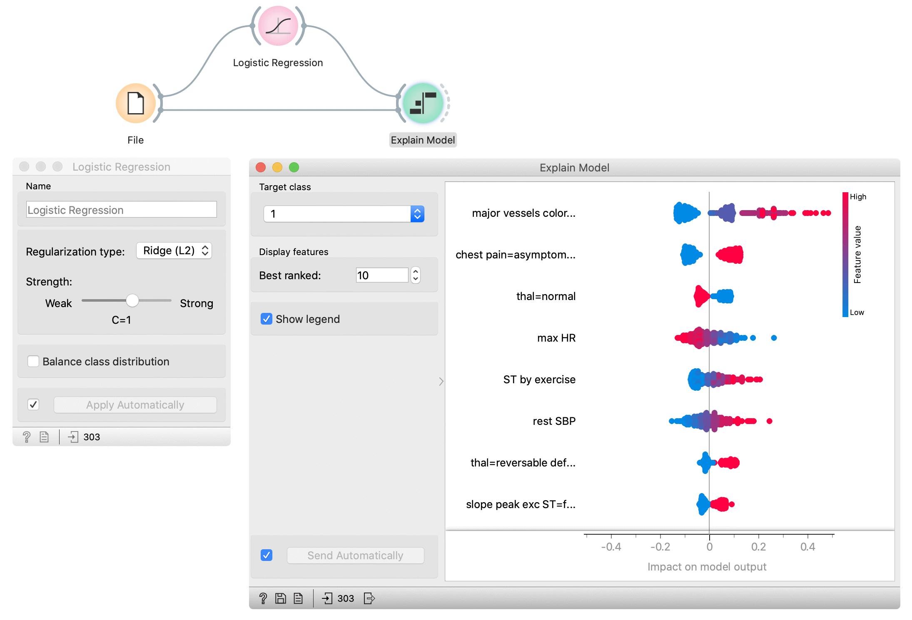

Explain Model
=============

Explains a classification or regression model. Explains which features contribute the most and how they contribute toward the prediction for a specific class.

**Inputs**

- Data: dataset used to compute the explanations
- Model: a model which widget explains

**Outputs**

- Selected data: data instance that belong to selected points in the plot
- Scores: The score of each attribute. Features that contribute more toward the final prediction have higher scores.

**Explain Model** widget explains classification and regression models with SHAP library. The widget gets a trained model and reference data on input. It uses the provided data to compute the contribution of each feature toward the prediction for a selected class. 

1. Select the target class -- the plot will show explanations for this class.
2. Select number of the features shown in the plot.
3. Show/hide the legend.
4. Plot which shows the selected number of features that are most important for a model. For each feature, points in the graph show SHAP values (horizontal axis) for each data instance (row) in the data. SHAP value is a measure of how much each feature affect the model output. Higher SHAP value (higher deviation from the centre of the graph) means that feature value has a higher impact on the prediction for the selected class. Positive SHAP values (points right from the centre) are feature values with the impact toward the prediction for the selected class. Negative values (points left from the centre) have an impact against classification in this class. For regression, SHAP value shows how much the feature value affects the predicted value from the average prediction. Colours represent the value of each feature. Red colour represents higher feature value, while blue colour is a lower value. The colour range is defined based on all values in the dataset for a feature.
5. Press *Apply* to commit the selection.
6. Get help, save the plot, make the report, or observe the size of input and output data.

Example
-------

In the flowing example, we use the Explain Model widget to explain Logistic regression model. In the File widget, we open Hearth disease dataset. We connect it to Logistic regression widget, which trains the model. Explain Model widget accepts the model and data which are used to explain the model. For an explanation, we usually use the same data than for training, but it is also possible to explain the model on different data. In the Explain model widget, we set the target class on the class to 1 -- it means that we observe features that contribute the most to the prediction of a patient with diagnosed heart disease. 

Features in the plot are ordered by their relevance to the prediction. Major vessels coloured is the most important for the prediction in class 1. Instances with higher values of this feature (red colour) have higher SHAP values which mean they contribute toward the prediction of class 1. Lower values of this attribute (blue) contribute against the prediction of this class. The second most important attribute is chest pain (categorical attribute) with value asymptomatic. The presence of this category for the patient (red colour) contributes toward the prediction of class 1, while the absence of this category contributes against class 1.  

