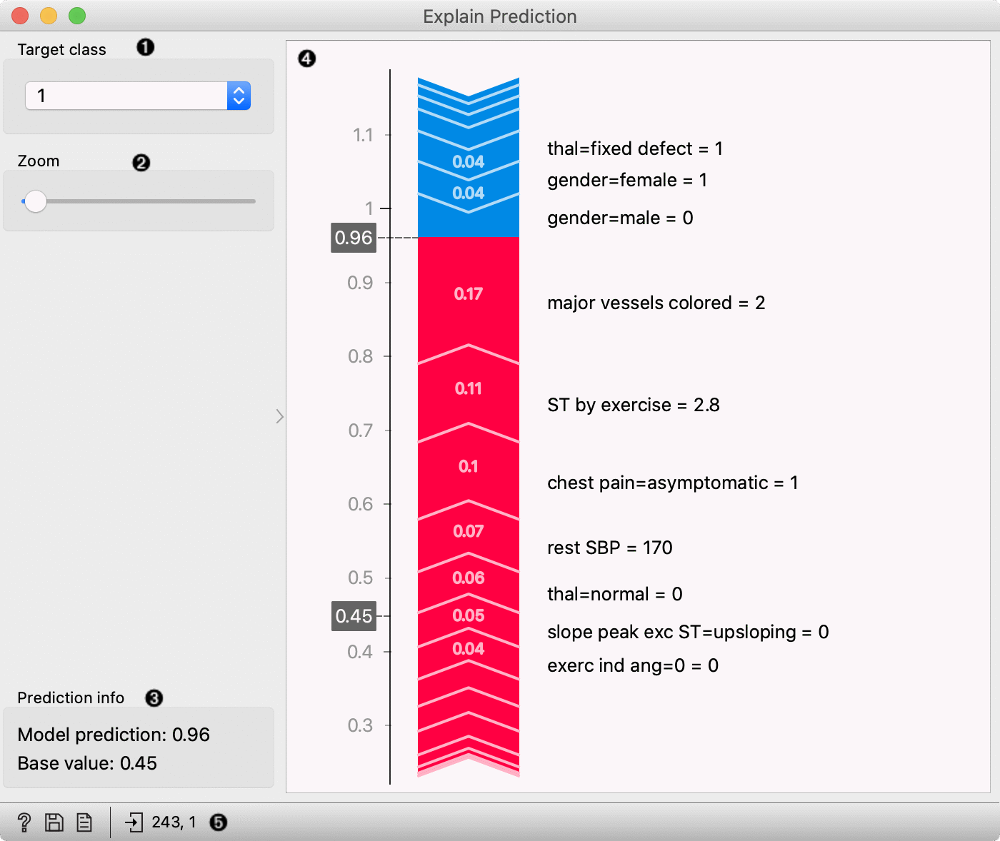
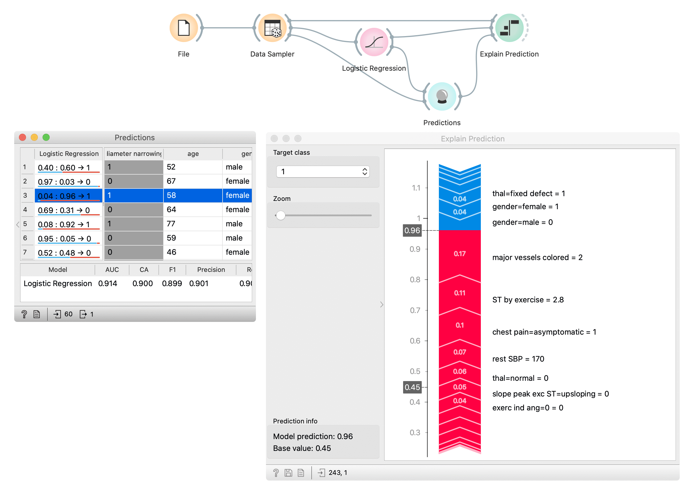

Explain Prediction
==================

Explains which features contribute the most to the prediction for a single instance based on the model and how they contribute.

**Inputs**

- Model: a model whose predictions are explained by the widget
- Background data: data needed to compute explanations
- Data: Single data instance whose prediction is explained by the widget

**Outputs**

- Scores: The SHAP value of each features value. Features that contribute more to prediction have higher score deviation from the 0.

**Explain Prediction** widget explains classification or regression model's prediction for the provided data instance. The widget shows what features affect the prediction of selected class the most and how they contribute (towards or against the prediction). The explanation is computed with removing features, replacing them with different options from the background data, and observing the change in the prediction.

1. Select the target class -- the plot will show explanations for this class.
2. Zoom in/out the plot.
3. Observe the prediction probability for a class and base value -- an average probability in the dataset.
4. Plot which shows features that affect the prediction the most (features with longer tape length) and how they affect it. Red features increase the probability for a selected class while blue features decrease the probability. On the right from the tape, you can see the feature name and its value\* for the selected instance. The length of the tape segment (and number on the tape) represent the SHAP value for feature contribution -- it is how much the feature affects the probability for the selected class. Numbers in the gray boxes indicate the prediction probability for the selected class is (0.6) and the baseline probability (0.45) (the average probability in the data).  
6. Get help, save the plot, make the report, or observe the size of input and output data.

\* Some models (including logistic regression) extend the categorical feature to more features with the technique named [one-hot encoding](https://en.wikipedia.org/wiki/One-hot). It means each value in the feature gets a new column which has value 0 (the instance does not have this feature value) or 1 (the instance has this feature value) for each instance. In those cases categorical features will be labeled with the format `feature-name=feature-value = 0/1` -- e.g. `chest pain=asymptomatic = 1`. It means that the feature chest pain has value asymptomatic. Model, in this case, made more columns for feature chest pain, one of them was asymptomatic, and it was the case for the selected data instance.

Example
-------
 
First, we open heart disease dataset in File widget. With the Data Sampler widget, we split the dataset on the training and test set. The training set is used to train the logistic regression model with the Logistic Regression widget. We compute predictions for the test part of the dataset (remaining data from Data Sampler) with the Predictions widget. In the Predictions widget (the left window) we select the data instance whose prediction we would like to explain -- we select the third row in the data which is predicted to belong to class 1 (diagnosed heart disease). 

Explain Prediction widget accept three inputs. First is the model from the Logistic Regression widget, background data from the Data Sampler (we usually use model's training data as background data), and the data instance whose prediction we want to explain with the Explain Prediction widget. In the widget we select class 1 as a target class, it means we are explaining what features and how they affect the prediction probability for the selected class 1. Numbers in the gray boxes in the plot indicate that the prediction probability for the selected class is 0.6 (border between red and yellow tape) and the baseline probability is 0.45 (the average probability in the data).

Features marked red on the tape push probabilities from the baseline probability toward probability 1.0 (prediction of the selected class), and blue features push against the prediction of the selected class. Numbers on the tape are SHAP values for each feature -- this is how much the feature (and its value) changes the probability toward or against the selected class. We can see that the highest impact on the prediction has the feature *major vessels coloured* with the value 2 and *ST by exercise* with the value 2.8. Two important features that push against the prediction of class 1 are *gender=male* with value 0 (which means that the patient is not male) and *gender=female* with the value 1 (patient is female - actually another feature with the same meaning that previous).  

