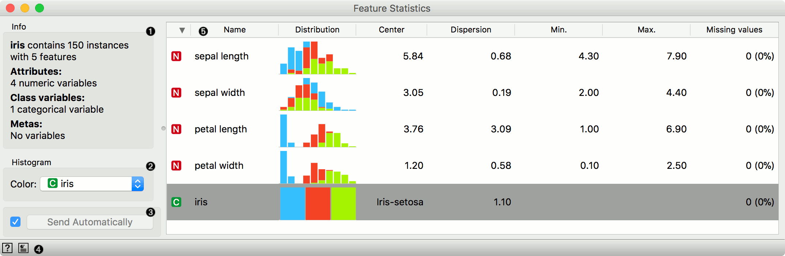
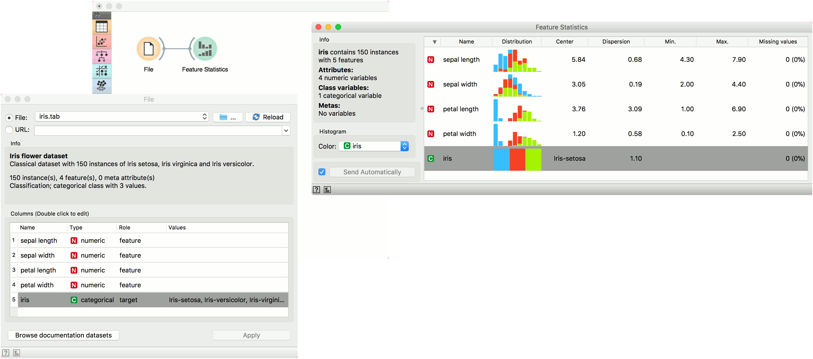

Feature Statistics
==================

Show basic statistics for data features.

Inputs
    Data
        input dataset

Outputs
    None

The **Feature Statistics** widget displays basic infomation on feature type, its distribution, center, standard deviation, minimum and maximum value and the proportion of missing values.

1. Information on the input data.
2. Color histrograms in Distribution column by a feature.
3. Click *Send* to commit the changes. To communicate changes automatically tick *Send Automatically*.
4. Access widget help and create a report.
5. Feature statistics table:

   - feature type (numeric, categorical, text or time)
   - feature name
   - distribution in histogram (continuous variables binned in 10 bins). Class variable is used as color by default.
   - center of the feature (mean for numeric, mode for categorical, text and time report nan)
   - dispersion of the feature (standard deviation for numeric, entropy for categorical)
   - minimum value
   - maximum value
   - percentage of missing values

Example
-------

We will use *iris* data in the **File** widget and pass it to **Feature Statistics**. We see that *iris* data has 4 numeric features and 1 categorical class variable. Distributions in the widget are colored by class, where iris-setosa is blue, iris-versicolor red and iris-virginica green. We can observe other basic statistics and see whether there are any missing values in our data.

Try changing the data set to *housing*, *banking-crises* and *zoo* to observe different feature types.

