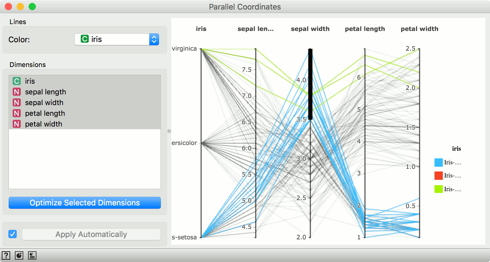
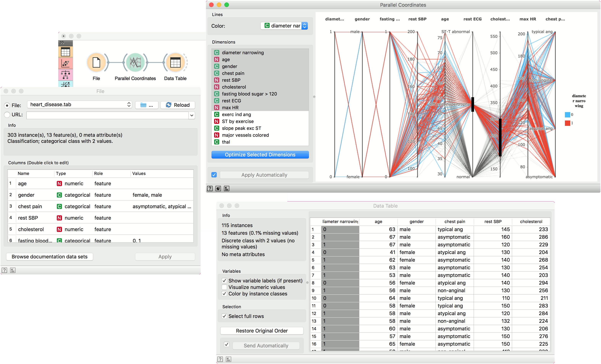

Parallel Coordinates
====================

Parallel coordinates display of multi-dimensional data.

Inputs
    Data
        input dataset
    Features
        list of attributes

Outputs
    Selected Data
        instances selected from the plot
    Annotated Data
        data with an additional column showing whether a point is selected
    Features
        list of attributes

The **Parallel Coordinates** widget shows `high-dimensional data in a plot <https://en.wikipedia.org/wiki/Parallel_coordinates>`_. The widget will display the first 9 attributes and color them by class, if class is present. The widget also enables plot optimization and subset selection.

.. figure:: images/Parallel-Coordinates-stamped.png

1. Color lines (instances) by an attribute. Colored by class by default.
2. Select the dimensions you wish to display. Click *Optimizie Selected Dimensions* to optimize the plot.
3. Click *Apply* to commit the changes. To communicate changes automatically tick *Apply Automatically*.
4. Access help, save image and produce a report.

To select a subset from the plot, hover over the dimension until you see the cursor change to a + and drag the selection across the dimension. Selected data instances will be on the output of the widget. You can select several subsets of dimensions - only those data instances that match the all the criteria will be on the output. To remove the selection, click on the dimension outside of the selected range.

Example
-------

**Parallel Coordinates** can display multi-dimensional data, hence we will use *heart-disease* data set. We load it with the **File** widget and send it to **Parallel Coordinates**. We optimized the projection and selected patients who have *left vent hypertrophy* and a cholesterol level between 200 and 300. Finally, we sent the selected patients to **Data Table** for observation.

